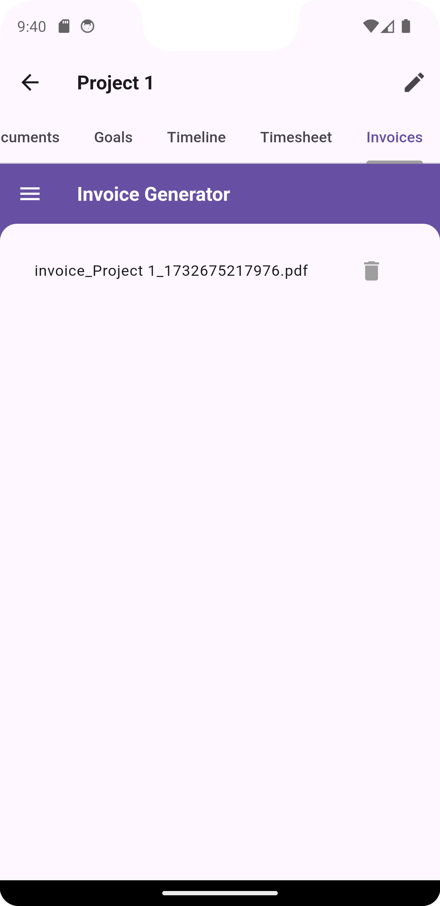

# Freelance Time Tracker

A comprehensive time tracking and project management application for freelancers. This app is designed to manage projects, time logs, invoices, goals, and timelines efficiently.

Developed by **CodēCodes**  
Portfolio: [CodēCodes Portfolio](https://www.cod-e-codes.com/)  
GitHub: [CodēCodes GitHub](https://github.com/Cod-e-Codes)

## Features
- **Project Management**: Add, edit, and delete projects with details like deadlines, hourly rates, and client information.
- **Time Tracking**: Log work sessions with start and end times, calculate durations, and track total logged hours per project.
- **Invoices**: Generate professional invoices with task details, calculate taxes, and save or share as PDFs.
- **Goals**: Set and track project-specific goals, measure progress, and visualize completion rates.
- **Timelines**: Manage project timelines with events and milestones.
- **Documents**: Upload, view, and manage project-related documents.
- **Tabs for Details**: Navigate between project tabs like details, goals, documents, timelines, and timesheets.

## Installation
1. Clone this repository:
   ```bash
   git clone https://github.com/Cod-e-Codes/freelance-time-tracker.git
   ```
2. Navigate to the project directory:
   ```bash
   cd freelance-time-tracker
   ```
3. Install dependencies:
   ```bash
   flutter pub get
   ```
4. Run the app:
   ```bash
   flutter run
   ```

## How to Use
1. **Add Projects**: Use the "Add Project" button to create a new project. Provide details such as project name, hourly rate, deadline, and client email.
2. **Track Time**: Log your work sessions and view total time logged for each project in the Timesheet tab.
3. **Generate Invoices**: Add tasks, calculate totals, and generate professional invoices as PDFs in the Invoice tab.
4. **Set Goals**: Define and track project-specific goals in the Goals tab.
5. **Manage Timelines**: Add events to the project timeline and view them in the Timeline tab.
6. **Upload Documents**: Manage project documents in the Documents tab.

## Dependencies
This app uses the following packages:
- **Hive**: Local database for storing project and time log data.
- **Provider**: State management for projects and app settings.
- **Flutter Backdrop**: A modern backdrop navigation component for easy tab navigation.
- **PDF Widgets**: Generate professional invoices as PDFs.
- **Path Provider**: Access application directories for file storage.
- **File Picker**: Upload documents and manage files.

## Screenshots

Below are some screenshots showcasing the app's features:

### Home Screen
  

### Project Details
  

### Documents Tab
  

### Goals Tab
  
  

### Invoice Generation
  
  
  

### Timeline
  
  

## License
This project is licensed under the MIT License. See the LICENSE file for more details.

---

Developed with ❤️ by CodēCodes
